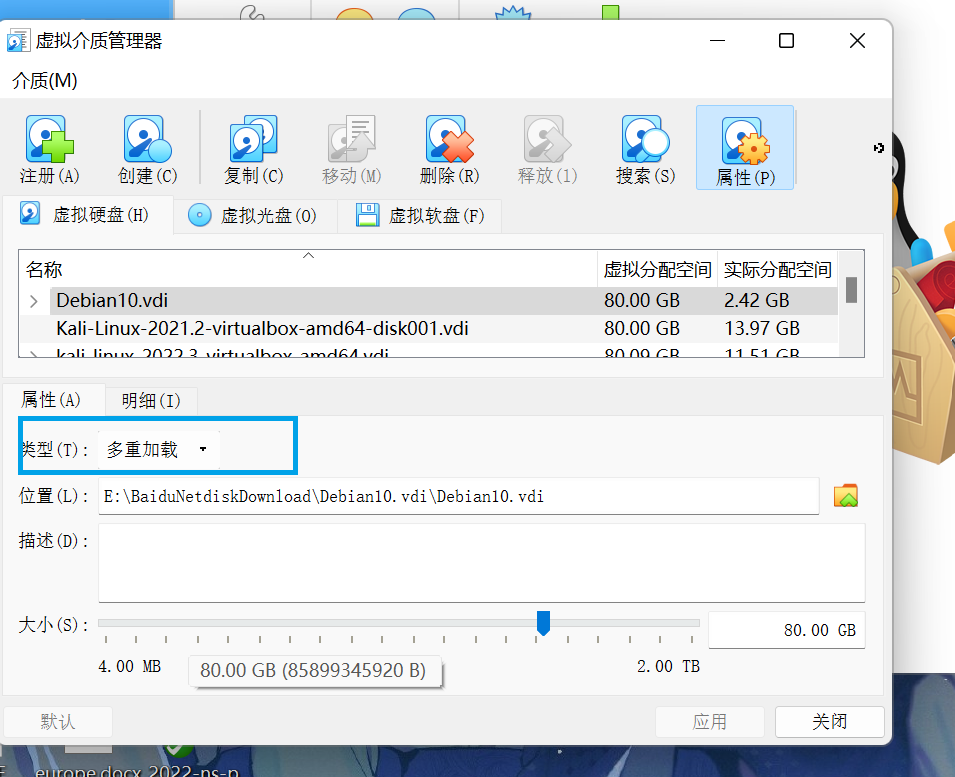
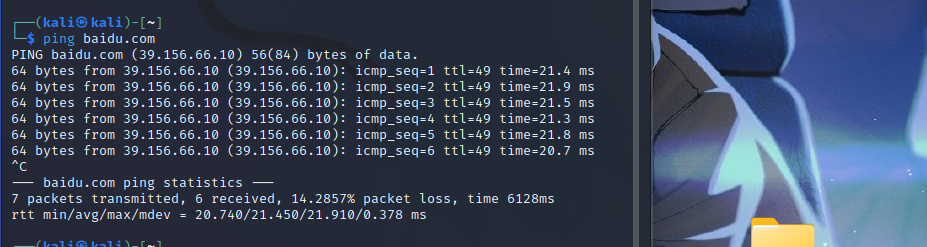

#  基于 VirtualBox 的网络攻防基础环境搭建


## 实验目的

- 掌握 VirtualBox 虚拟机的安装与使用；
- 掌握 VirtualBox 的虚拟网络类型和按需配置；
- 掌握 VirtualBox 的虚拟硬盘多重加载；


## 实验环境

以下是本次实验需要使用的网络节点说明和主要软件举例：

- VirtualBox 虚拟机
- 攻击者主机（Attacker）：Kali Rolling 2019.2
- 网关（Gateway, GW）：Debian Buster
- 靶机（Victim）：From Sqli to shell / xp-sp3 / Kali


## 实验要求


- 虚拟硬盘配置成多重加载，效果如下图所示；


- 搭建满足如下拓扑图所示的虚拟机网络拓扑；


> 根据实验宿主机的性能条件，可以适度精简靶机数量

- 完成以下网络连通性测试；

  - [x] 靶机可以直接访问攻击者主机

  - [x] 攻击者主机无法直接访问靶机

  - [x] 网关可以直接访问攻击者主机和靶机

  - [x] 靶机的所有对外上下行流量必须经过网关

  - [x] 所有节点均可以访问互联网


## 实验步骤


1. 虚拟硬盘设置成多重加载

   

   如上图所示，将 `Debian10.vdi` `kali-linux-2022.3-virtualbox-amd64.vdi` `xp_sp3_base.vdi` 设置成多重加载。在 `管理` 的 `虚拟介质管理` 中找到以上虚拟硬盘文件，将其设置成 `多重加载`

   

   用以上虚拟硬盘文件导入实验所需的虚拟机，如下图所示：

   

2. 配置网络

   目标网络拓扑图如下所示：

   

   - 网关 `gateway` 网卡配置情况：

     `NAT` 用来连接互联网， `Host-Only` 网卡用来方便宿主机 `SSH` 远程登录， 两个 `内部网络` 网卡用来连接拓扑图中的两个内网。

   - 受害者网卡配置情况：

     `WinXP` 的网卡选择 `内部网络` ，控制芯片选择 `PCnet-FAST III`。

     

     `debian10` 和 `kali` 的网卡选择 `内部网络`，控制芯片分别选择 `Intel PRO/1000 MT桌面` 

     

     此处不需要选择 `NAT` 也能使主机上网，因为他们的流量会通过联网的网关。

   - 攻击者网卡配置情况

     

     此时不考虑使用宿主机与之远程登录。所以配备一个 `NAT` 网卡使之能访问互联网即可。

3. 网络连通性测试

   - 靶机可以直接访问攻击者主机

     攻击者主机 IP 地址如下：

     

     `victim-winxp-1` 情况如图：

     

     

     因宿主机性能，`victim-kali-1` 访问攻击者的情况省略。

     

     `victim-winxp-2` 情况如图：

     

     `victim-debian-2` 情况如图：
   
     
   
   - 攻击者主机无法直接访问靶机
   
   	`victim-winxp-1` 情况如图：
   	
   	
   	
   	
   	
   	`victim-kali-1` 情况如图：
   	
   	
   	
   	
   	
   	`victim-winxp-2` 情况如图：
   	
   	
   	
   	
   	
   	`victim-debian-2` 情况如图：
   	
   	
   	
   	
   	
   	从以上情况能看出，攻击者无法访问任何一台靶机。
   	
   - 网关可以直接访问攻击者主机和靶机
   
   	网关访问攻击者主机如图：
   	
   	
   	
   	
   	
   	网关访问 `victim-kali-1` 如图：
   	
   	
   	
   	 
   	
   	网关访问 `victim-winxp-1` 如图：
   	
   	
   	
   	 
   	
   	网关访问 `victim-winxp-2` 如图：
   	
   	
   	
   	 
   	
   	网关访问 `victim-debian-2` 如图：
   	
   	
   	
   	 
   	
   	网关到靶机和攻击者主机都是连通的。
   	
   	说明：测试时靶机更换过 ip 地址，所以有可能前后 ip 地址对不上。
   
   - 靶机的所有对外上下行流量必须经过网关
   
     
   
     使用老师提供的虚拟硬盘文件创建的虚拟机自带 `dnsmasq` ，并且已经设置了日志写到 `/var/log/dnsmasq.log` 里。在用 `靶机` 访问互联网的时候，例如：
   
     ``` bash
     ping taobao.com
     ```
   
     此时靶机能够正常收到淘宝返回的 ICMP 包。同时打开 `gateway` 的 `dnsmasq.log` ，可以看到日志同步多出几条记录。如上图。
   
     ` 172.16.111.124` 是靶机的 IP 地址，`192.168.3.1` 是宿主机网关。能反应出靶机所有对外流量经过了 `gateway` 。
   
   - 所有节点均可以访问互联网
   
     网关到互联网：
   
     
   
     
   
     攻击者主机到互联网：
   
     
   
     
     
     `victim-kali-1` 到互联网：
     
     
     
     
     
     `victim-winxp-1`  到互联网：
     
     
     
     
     
     `victim-winxp-2` 到互联网：
     
     
     
     
     
     `victim-debian-2` 到互联网：
     
     
     
     
     
     测试出每个节点都可连接互联网。


## 问题及解决方法


### 网关同时作为 DHCP 服务器的问题


参考哥姐的实验报告，如果内网的靶机想要获得 IP 地址，则需要一台服务器作为 DHCP 服务器为他们分配，他们使用 `gateway` 作为 `DHCP` 服务器。经过检查发现，老师提供的 `.vdi` 文件已经配置好了相关内容，只需要配置好网卡就可以正常连通使用。


### WinXP 系统靶机没有 IP 地址的问题


打开 `WinXP` 系统的靶机发现有 「安装硬件」 的向导。以为是老版本的 windows 的小把戏，忽略了。但是在查看 IP 地址时，发现并没有显示其 IP 地址。

是 `gateway` 没能正常分配 IP 地址吗？查看同网段下的 `victim-debian-2` ，发现它是有 IP 地址的，说明 `gateway` 作为 DHCP 服务器没有故障。那么就是 `Windows XP` 靶机的问题。参考哥姐的实验报告，外加 「安装硬件」 的向导，怀疑该靶机没有正常安装网卡。检查发现我当时为其使用的网卡是：内部网络类型，控制芯片为 `Intel PRO/1000 MT 桌面` 的网卡。但是这个网卡只能适配于 `Windows Vista` 版本之后的系统，而 `Windows XP` 是其之前的系统版本。所以对于系统来说，网卡未安装，自然没有 IP 地址。


但是 `PCnet-FAST III` 芯片可以适应 `Windows XP ` 系统。所以将控制芯片改成该芯片即可。


### ping 不通 WinXP 系统靶机的问题


`gateway` 访问攻击者主机、 `debian` 系统靶机和 `kali` 系统靶机都没有出现问题，只有访问 `Windows XP` 系统的靶机时出现无响应状态。同时，`Windows` 的靶机可以访问互联网。说明 `Windows XP` 系统的靶机拒绝配合 `ping` 命令，并不一定表示 `Windows` 系统断网。拒绝配合 `ping` 可能是因为系统安全策略中拒绝回显。只要修改防火墙的规则即可。


修改结果已经在实验报告中体现。


## 参考资料


- [Virtual Networking Hardware](https://docs.oracle.com/en/virtualization/virtualbox/6.0/user/nichardware.html)

- [许师哥的实验报告](https://github.com/CUCCS/2021-ns-public-EddieXu1125/tree/chap0x01/chap0x01)

- [实验 · 网络安全 (c4pr1c3.github.io)](https://c4pr1c3.github.io/cuc-ns/chap0x01/exp.html)