# 实验五：基于 Scapy 编写端口扫描器


## 实验目的


掌握网络扫描之端口状态探测的基本原理


## 实验要求


- [x] 禁止探测互联网上的 IP ，严格遵守网络安全相关法律法规
- [ ] 完成以下扫描技术的编程实现
  - [ ] TCP connect scan / TCP stealth scan
  - [ ] TCP Xmas scan / TCP fin scan / TCP null scan
  - [ ] UDP scan
- [ ] 上述每种扫描技术的实现测试均需要测试端口状态为：`开放`、`关闭` 和 `过滤` 状态时的程序执行结果
- [ ] 提供每一次扫描测试的抓包结果并分析与课本中的扫描方法原理是否相符？如果不同，试分析原因；
- [ ] 在实验报告中详细说明实验网络环境拓扑、被测试 IP 的端口状态是如何模拟的
- [ ] （可选）复刻 `nmap` 的上述扫描技术实现的命令行参数开关


## 知识储备


- TCP connect scan

  

  | 方向           | 开放流程    | 被过滤流程  | 关闭流程    |
  | -------------- | ----------- | ----------- | ----------- |
  | krad -> scanme | SYN+port(n) | SYN+port(n) | SYN+port(n) |
  | scanme -> krad | SYN+ACK     | nothing     | RST         |
  | krad -> scanme | ACK         |             |             |
  | krad -> scanme | RST         |             |             |

  

- TCP stealth scan

  

  | 方向           | 开放流程    | 被过滤流程  | 关闭流程    |
  | -------------- | ----------- | ----------- | ----------- |
  | krad -> scanme | SYN+port(n) | SYN+port(n) | SYN+port(n) |
  | scanme -> krad | SYN+ACK     | nothing     | RST         |
  | krad -> scanme | RST         |             |             |

  

- TCP Xmas scan / TCP fin scan / TCP NULL scan

  TCP Xmas scan: 对 `PSH` , `URG` , `FIN` 三个状态位设置为 1 。

  TCP fin scan: 对 `FIN` 状态设置为 1 。

  TCP NULL scan: 关闭所有报文头设定。

  | 方向           | 关闭流程                                              | 开放、被过滤流程                              |
  | -------------- | ----------------------------------------------------- | --------------------------------------------- |
  | krad -> scanme | FIN+URG+PSH+port(n) / FIN+port(n) / 000000000+port(n) | FIN+URG+PSH+port(n) / FIN / 000000000+port(n) |
  | scame -> krad  | RST                                                   | nothing                                       |

  通过绕过阻挡带 `SYN` 和 `ACK` 位的数据包的防火墙来达到扫描目的。

  

- UDP scan

  

  | 方向           | 关闭流程                                     | 开放、被过滤流程 |
  | -------------- | -------------------------------------------- | ---------------- |
  | krad -> scanme | UDP+port(n)                                  | UDP+port(n)      |
  | scame -> krad  | ICMP port unreachable error (type 3, code 3) | nothing          |

  


## 实验环境


kali: 5.18.0

scapy: 2.4.4

python: 3.10.5

网络拓扑图如下：

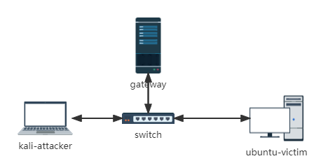

## 实验过程


- TCP connect scan

  代码实现：

  ```python
  from scapy.all import *
  
  dst='172.16.111.145'
  srcp = RandShort()
  dstp = 8080
  
  print("---------------TCP scaning start-----------------")
  recv = sr1(IP(dst=dst)/TCP(sport=srcp,dport=dstp,flags="S"),timeout=10)
  
  if str(type(recv)) == "<class 'NoneType'>":
  	sta = 'filterd'
  elif recv[1].flags=='RA':
  	sta = 'closed'
  elif recv[1].flags == 'SA':
  	sta = 'open'
  	finalpkt=IP(dst=dst)/TCP(sport=srcp,dport=dstp,flags="RA")
  	send(finalpkt)
  else:
  	sta='?'
  print("--------------------scan is over-------------------")
  print('port '+str(dstp)+' on '+dst+' is '+ sta)
  ```

  - 首先，在`端口关闭`的情况下测试

    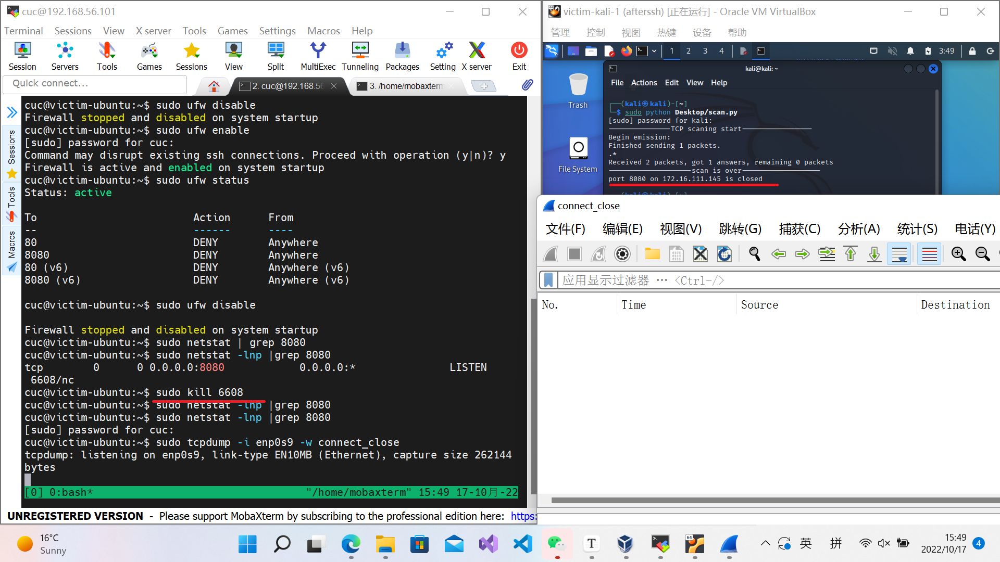

    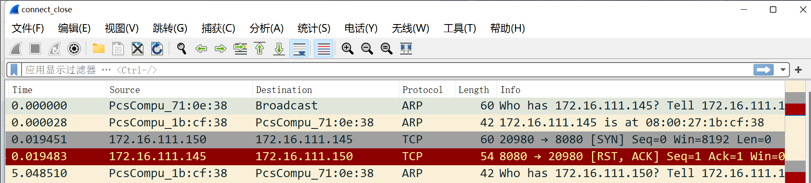

    此时，受害者主机向攻击者主机发送了 `RST,ACK` 的包，符合要求。

  - 再在`端口开放`的时候测试。

  ```bash
  # 打开端口
  	sudo nc -l -p 8080
  ```

  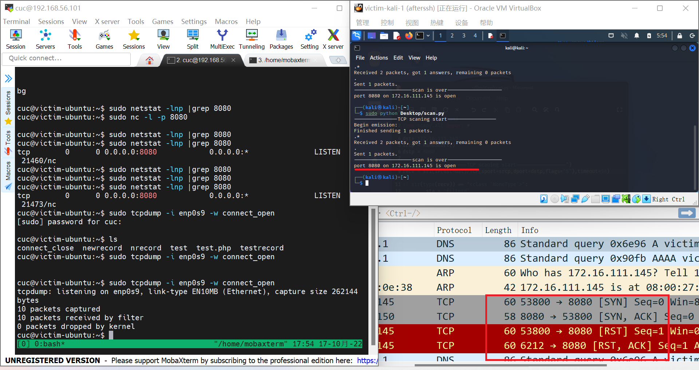

  ​	端口开放时会有 `SYN` 和 `ACK` ，符合要求。

  - 再打开防火墙，测试 `被过滤` 的情况。

    对防火墙进行设置。

    ```bash
    sudo ufw deny 8080
    ```

    在 `8080` 端口上过滤。

    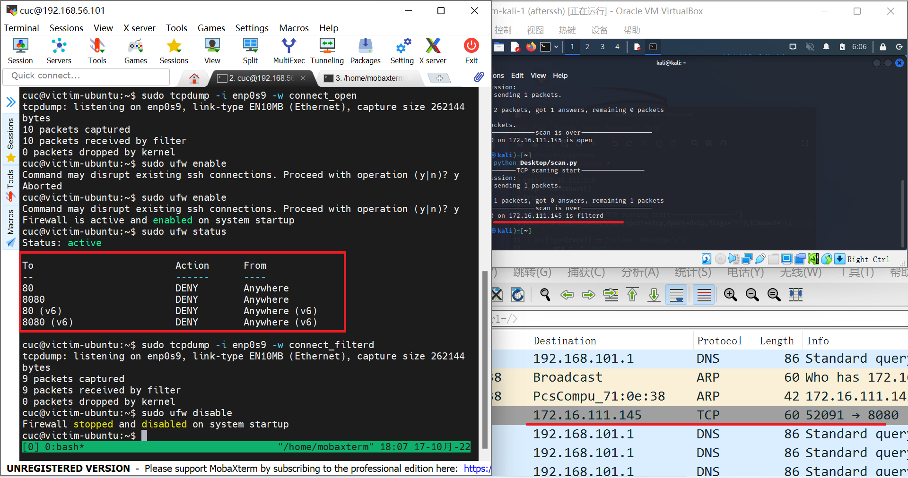

    确实没有受到任何回信，符合课本上的描述。

- TCP stealth scan

  代码实现：

  ```python
  #! /usr/bin/python3
  
  from scapy.all import *
  
  dst='172.16.111.145'
  srcp = RandShort()
  dstp = 8080
  
  print("---------------TCP scaning start-----------------")
  recv = sr1(IP(dst=dst)/TCP(sport=srcp,dport=dstp,flags="S"),timeout=10)
  
  if str(type(recv)) == "<class 'NoneType'>":
  	sta = 'filterd'
  elif recv[1].flags=='RA':
  	sta = 'closed'
  elif recv[1].flags == 'SA':
  	sta = 'open'
  	finalpkt=IP(dst=dst)/TCP(sport=srcp,dport=dstp,flags="R")
  	send(finalpkt)
  else:
  	sta='?'
  print("--------------------scan is over-------------------")
  print('port '+str(dstp)+' on '+dst+' is '+ sta)
  ```

  - 首先测试开放情况

    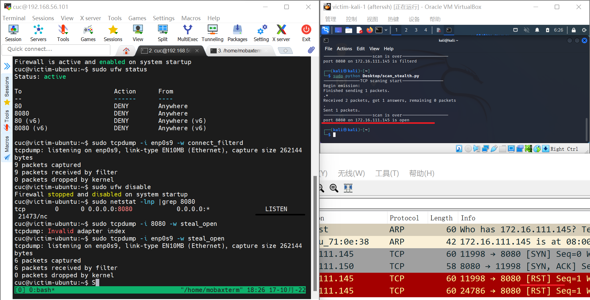

    符合课本预期

  - 测试关闭情况

    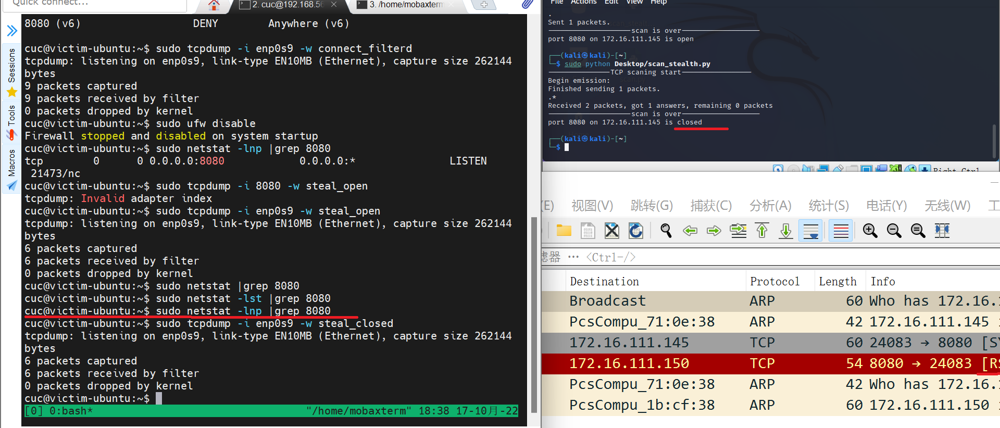

    符合课本预期。

  - 测试过滤情况

    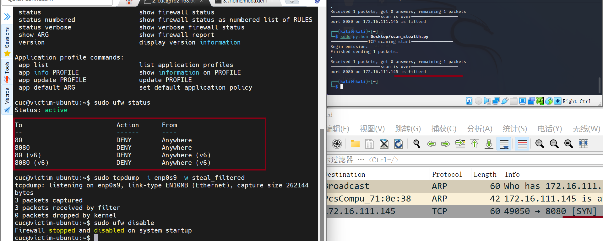

    符合课本预期。

- TCP Xmas scan / TCP fin scan / TCP NULL scan

  代码实现：

  ```python
  #! /usr/bin/python3
  from scapy.all import *
  
  dst='172.16.111.145'
  srcp = RandShort()
  dstp = 8080
  
  print("---------------TCP xmas scan start-----------------")
  recv = sr1(IP(dst=dst)/TCP(sport=srcp,dport=dstp,flags="FPU"),timeout=10)
  
  if str(type(recv)) == "<class 'NoneType'>":
  	sta = 'filterd OR open'
  elif recv[1].flags=='RA':
  	sta = 'closed'
  else:
  	sta='?'
  print("--------------------TCP xmas scan is over-------------------")
  print('port '+str(dstp)+' on '+dst+' is '+ sta)
  
  print("--------------- TCP fin scan start-----------------")
  
  recvf = sr1(IP(dst=dst)/TCP(sport=srcp,dport=dstp,flags="F"),timeout=10)
  
  if str(type(recvf)) == "<class 'NoneType'>":
  	sta = 'filterd OR open'
  elif recvf[1].flags=='RA':
  	sta = 'closed'
  else:
  	sta='?'
  print("--------------------TCP fin scan is over-------------------")
  print('port '+str(dstp)+' on '+dst+' is '+ sta)
  
  print("--------------- TCP NULL scan start-----------------")
  
  recvn = sr1(IP(dst=dst)/TCP(dport=dstp,flags=""),timeout=10)
  
  if str(type(recvn)) == "<class 'NoneType'>":
  	sta = 'filterd OR open'
  elif recvn[1].flags=='RA':
  	sta = 'closed'
  else:
  	sta='?'
  print("--------------------TCP NULL scan is over-------------------")
  print('port '+str(dstp)+' on '+dst+' is '+ sta)
  
  ```

  - 测试开放情况

    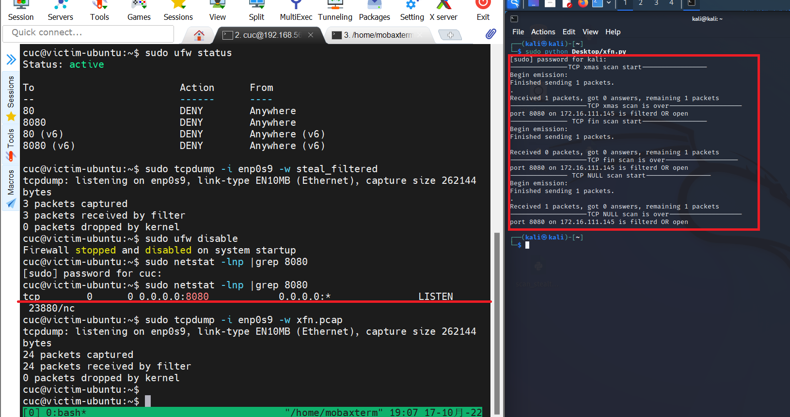

    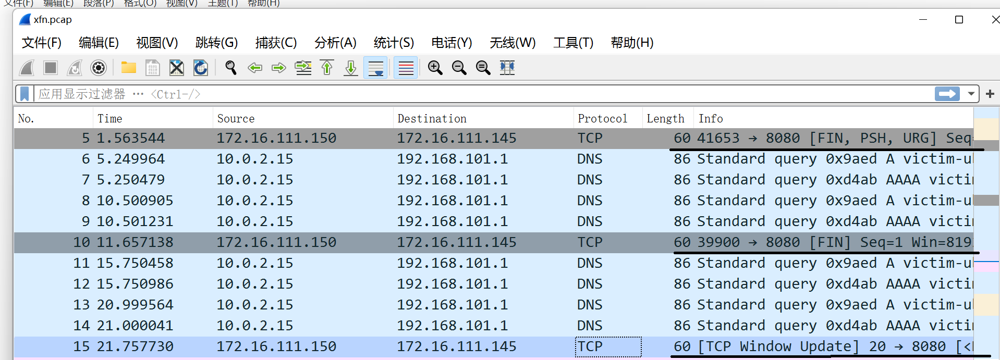

    可见在端口开放的情况下，`TCP Xmas scan` 、`TCP fin scan` 、`TCP NULL scan` 都不会收到反馈。

    符合课本描述

  - 测试过滤情况。

    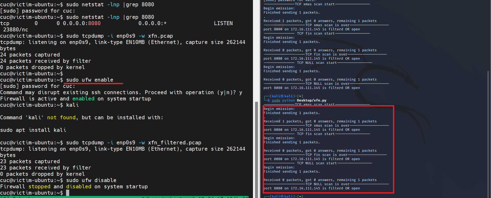

    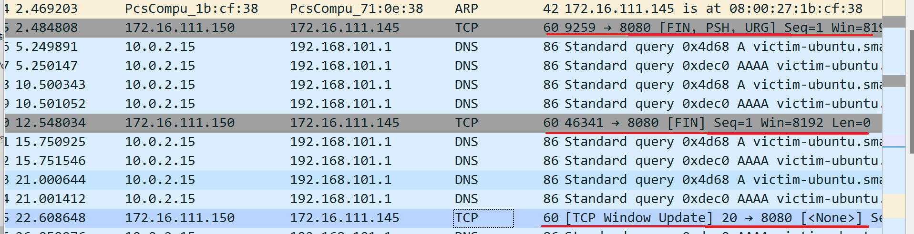

    在防火墙开启的情况下，受害者主机并没有向攻击者发送任何消息，符合课本描述

  - 测试关闭情况。

    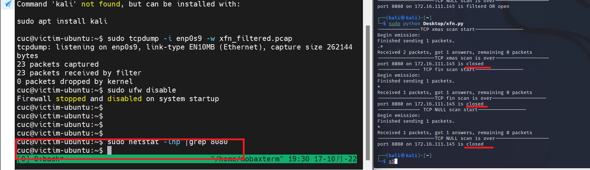

    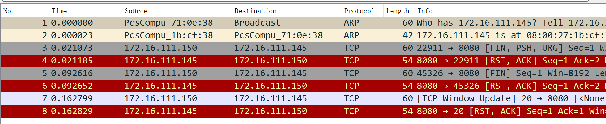

    可见，在端口关闭情况下，每一次被扫描者都会返回一个带 `RST` 位的 TCP 数据报。符合课本描述。

  - 

- UDP scan

  代码实现：

  ```python
  #! /usr/bin/python3
  from scapy.all import *
  
  dst='172.16.111.145'
  srcp = RaSndShort()
  dstp = 68 #或53
  
  print("---------------UDP scan start-----------------")
  recv = sr1(IP(dst=dst)/UDP(sport=srcp,dport=dstp),timeout=10)
  
  if str(type(recv)) == "<class 'NoneType'>":
  	sta = 'filterd OR open'
  elif recv[1][0].code==3:
  	sta = 'closed'
  else:
  	sta='?'
  print("--------------------UDP is over-------------------")
  print('port '+str(dstp)+' on '+dst+' is '+ sta)
  
  ```

  

  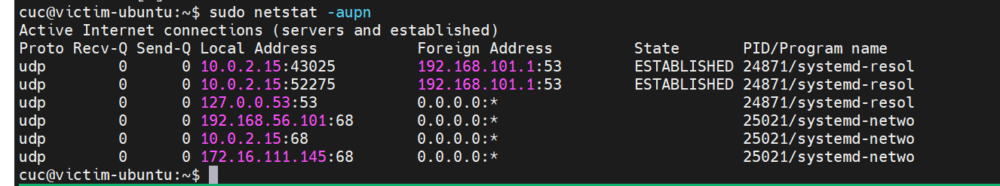

  

  此处，端口 `53` 被 `systemd-resolved` 占用，所以无法自由关闭开启。且，`172.16.111.145` 的 `53` 端口没有开启，所以 UDP 服务是关闭的。可以用此端口做测试。 `68` 端口被 `systemd-network` 占用，也无法自由关闭开启，它在 `172.16.111.145` 上是开启的。所以可以用该端口做开启测试。

  测试结果如下：

  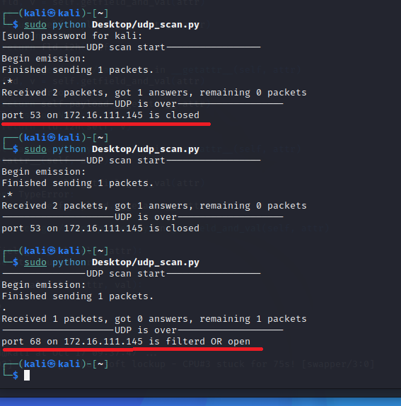

  在端口关闭的情况下（没有运行UDP程序的情况下），端口返回 `ICMP` 包，表示该端口无法到达。

  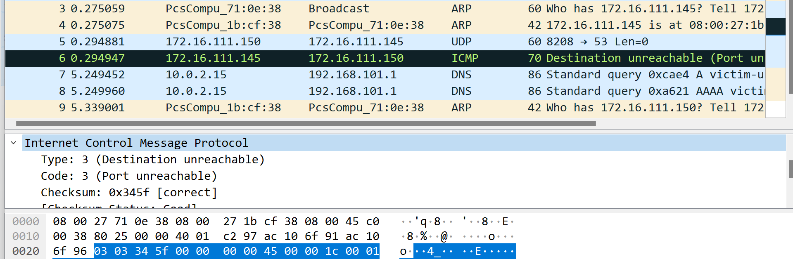

  在端口开启的情况下，端口不返回任何包。

  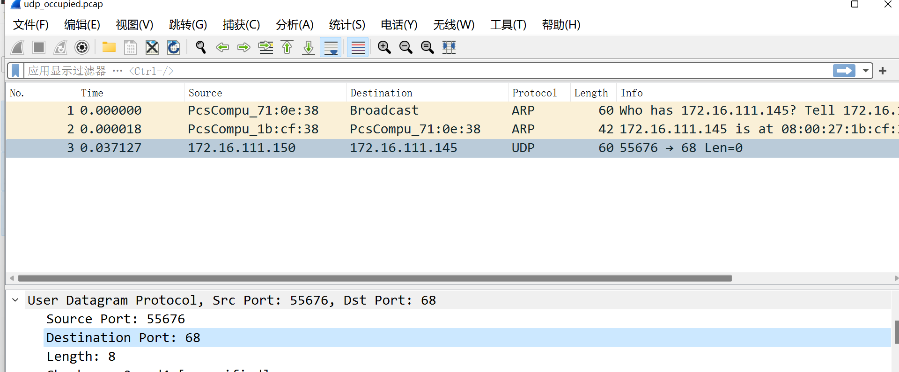

  符合课本描述。


## 问题


1. 如何开启、关闭和过滤端口？

   使用 `firewall` 来 `deny` 或者 `reject` 到此端口来的数据包，在我看来是 `filtered` 而非 `closed` 。因为端口和上面的程序是在运行着的。在参考师哥师姐的作业之后，我决定利用

   ```bash
   sudo nc -l -p xxxx
   ```

   来开启某个未被占用端口。通过监听该端口来打开端口，取消监听它而关闭它。

   而过滤，可以利用防火墙的 `deny` 来做。

2. 如何做 `UDP scan` 的实验？

   由于知名的 `UDP` 端口被占用且无法结束上面的服务，所以无法（没找到方法）连接其它服务，所以只能找两个状态各异的端口：一个开启，一个关闭。


## 参考资料

- [Nmap Network Scanning](https://nmap.org/book/toc.html)

- [第五章 网络扫描 · 网络安全 (c4pr1c3.github.io)](https://c4pr1c3.github.io/cuc-ns/chap0x05/main.html)

- [ubuntu20.04开放端口](https://blog.csdn.net/lianghecai52171314/article/details/113813826)

- [ 关于UDP接收icmp端口不可达](https://blog.csdn.net/mrpre/article/details/43451775)