# 第十一章： 常见蜜罐体验和探索


## 实验目的：

- 了解蜜罐的分类和基本原理
- 了解不同类型蜜罐的适用场合
- 掌握常见蜜罐的搭建和使用


##  实验要求

- 记录蜜罐的详细搭建过程；
- 使用 `nmap` 扫描搭建好的蜜罐并分析扫描结果，同时分析「 `nmap` 扫描期间」蜜罐上记录得到的信息；
- 如何辨别当前目标是一个「蜜罐」？以自己搭建的蜜罐为例进行说明；
- （可选）总结常见的蜜罐识别和检测方法；
- （可选）基于 [canarytokens](https://github.com/thinkst/canarytokens) 搭建蜜信实验环境进行自由探索型实验；


## 实验环境

- 虚拟机：Linux kali 5.18.0-kali5-amd64
- 宿主机：windows 11
- 蜜罐：cowrie, ssh-honeypot


## 实验步骤


### 蜜罐选择

| 蜜罐名称     | 交互性        | 特色                                                         | 互联网认证程度         | 维护情况          | 选择 |
| ------------ | ------------- | ------------------------------------------------------------ | ---------------------- | ----------------- | ---- |
| blacknet     | 低交互蜜罐    | `multi-head` 蜜罐，可以收集互联网上自己所拥有的多个 IPv4 地址上所有的 SSH 尝试。 | 9 stars, 2 forks       | 三年前            |      |
| cowrie       | 中/高交互蜜罐 | 记录攻击者的爆破和 shell 交互行为。中等交互模式下可以用 python 模拟 UNIX 系统。支持 Docker 版本。 | 4.1k stars, 775 forks  | 22天前            | 选择 |
| endlessh     | 不交互        | 非常缓慢地发送无尽的、随机的 SSH banner，使得在 22 端口尝试 SSH 登录的人卡住数小时甚至数天，以保护藏在其它端口的真正的 SSH 服务器。（具体情况可见视频[Added Security for Your SSH - Endlessh: an SSH tarpit](https://www.youtube.com/watch?v=ITRlqkYxWtw)） | 5.7k stars,  241 forks | 两年前            |      |
| HUDINX       | 中交互蜜罐    | 记录攻击者的爆破和 shell 交互行为。                          | 2 stars, 1 fork        | 四年前            |      |
| kippo        | 中交互蜜罐    | 记录攻击者的爆破和 shell 交互行为。集成了Debian 5.0 的文件系统，可以增删文件，session log 是 UML 可兼容格式，支持 wget 并保存下载文件。一些 trickery，ssh pretend 也支持。是 `cowrie` 的前身。 | 1.4k stars,275 forks   | 六年前            |      |
| kojoney      | 低交互蜜罐    | 模拟了一个 SSH server。                                      | kippo受它启发          |                   |      |
| ssh-lowpot   | 低交互蜜罐    | 在 2222 端口接受 SSH 链接，记录登录尝试，并告诉客户登录失败。 | 11 stars, 3 forks      | 2020 年2月3日提交 |      |
| sshsyrup     | 中交互蜜罐    | 允许任意 SSH 登录；有假的 shell 和 filesystem；支持 SFTP/SCP 上传下载文件；记录客户指纹；以 JSON 格式记录方便解析；当客户尝试端口转发时，记录本地和远程主机；可以扩展指令集 | 85 stars, 8 forks      | 三年前            |      |
| ssh-honeypot | 低交互蜜罐    | 监听 SSH 链接，记录客户登录的 IP 地址、用户名、密码。不允许登陆的。 | 503 stars,  233 forks  | 9个月前           | 选择 |

选择的中交互蜜罐是：`cowrie` 。

原因：

- 高评分。在 awesome honeypot 列表的中交互蜜罐中，它的 `star` 数和 `fork` 数是最高的。
- 维护中。最近一次提交在 22 天之前。
- 易搭建。有可用的 docker 版本，能够无痛安装（大概）。

选择的低交互蜜罐是： `ssh-honeypot` 。

原因：

- 高评分。awesome honeypot 列表中，该项目属于较高评分的。 `endlessh` 虽然评分更高，但它在攻击者尝试 SSH 登录后完全不给反馈，很难说它是 `交互的` 。
- 维护中。最近一次提交在 9 个月前。
- 易搭建。项目 `README` 中给出非常清楚的搭建方法，且只有三条指令，能够无痛搭建（大概）。


### 蜜罐搭建


#### 中交互蜜罐 cowrie 


##### 搭建

利用容器技术

```bash
docker run -p 2222:2222/tcp cowrie/cowrie:3972c598 
```

其中，`3972c598 ` 是支持 `AMD` 架构的 docker 镜像的 tag。宿主机的 CPU 是 AMD 架构的，所以使用该版镜像。

也可以创建 `docker-compose.yml` 文件，一键启动。

```docker-compose
version: '3'
services:
  cowrie:
    image: "cowrie/cowrie:3972c598"
    container_name: "cowrie-honeypot"
    ports:
      - "2222:2222"
    logging:
      driver: "json-file"
      options:    
        max-size: "10m"
```

现在 `cowrie` 蜜罐就在虚拟机上运行了。在宿主机上尝试登录。

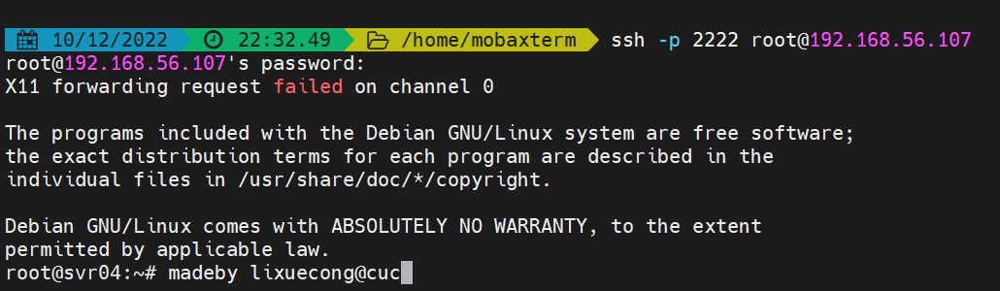

登陆成功。防御者视角看一下。

```
cowrie-honeypot | 2022-12-10T15:22:54+0000 [HoneyPotSSHTransport,2,192.168.56.106] login attempt [b'root'/b'22'] succeeded
```

在日志中，发现一条登录成功的日志。

然后在攻击者视角输入几条指令。

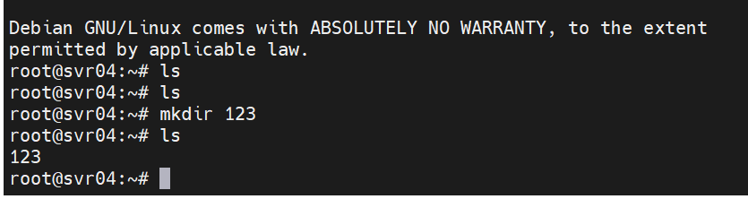

在防御者视角查看日志。

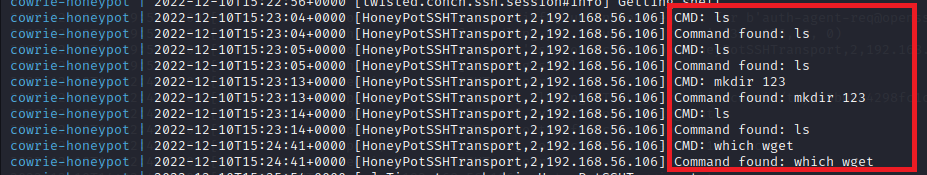


##### nmap扫描

把 `nmap` 扫描前的日志保存到一个日志文件，扫描后的日志保存到另一个文件。

```shell
sudo docker-compose logs cowrie > cowrie.log # 扫描前
sudo docker-compose logs cowrie > cowrie2.log # 扫描后
```

比较一下区别。

```shell
diff cowrie.log cowrie2.log 
```

输出如下：

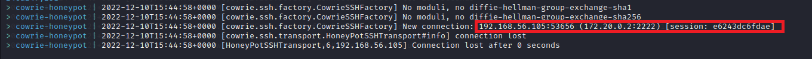

跟普通的 SSH 登录有所区别，nmap 扫描的日志输出比较简单。因为 nmap 扫描不做真实 SSH 登录。

##### 如何辨别蜜罐

1. 就本次搭建的蜜罐来说，一个显著特征是关闭很快（默认配置）。

   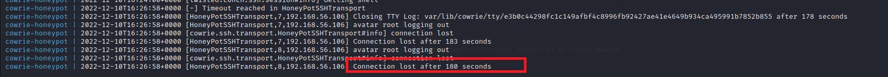

   三分钟后 SSH 链接自动关闭。而普通的主机 SSH timeout 没有这么快。

2. 没有关键软件。

   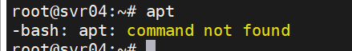

   正常的主机一般都是有 `apt` 的。

   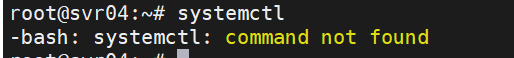

   正常的 `Debian` 主机一般也都有 `systemctl` 。


##### 低交互蜜罐 ssh-honeypot

根据[项目](https://github.com/droberson/ssh-honeypot)的 `README.md` 搭建蜜罐。克隆仓库到本地，然后执行：

```
make
ssh-keygen -t rsa -f ./ssh-honeypot.rsa
bin/ssh-honeypot -r ./ssh-honeypot.rsa
```

无脑搭建会产生一个问题。


说明 22 端口被占用。这是当然的，SSH 正常的服务正运行在 `22` 端口。需要修改配置文件。在 `scr` 文件夹里，修改 `config.h` ，更换端口就能解决问题。

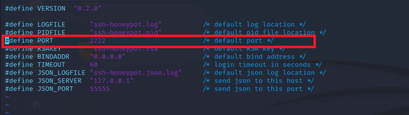

把原先绑定在 22 端口的服务更换到 2222 端口。然后在宿主机上尝试登录：

```bash
ssh -p 2222 root@192.168.56.107
```

出现报错：

```
no matching host key type found. Their offer: rsa-sha2-512,rsa-sha2-256
```

查询后得知，是算法不支持。用以下命令进行登录：

```bash
ssh -o HostKeyAlgorithms=+rsa-sha2-512 -o PubkeyAcceptedKeyTypes=+rsa-sha2-512  root@192.168.56.107 -p 2222
```

即可登录成功。在防御者一端查看记录：

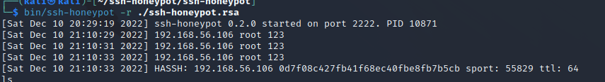

的确记录下了尝试登录者的 ip 地址和尝试登录的用户、口令、HASSH、使用端口和 ttl 。

而攻击者一侧，则得到了：

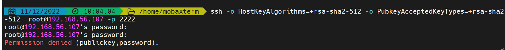

登录被拒绝。


##### nmap扫描

下面尝试用 nmap 扫描服务器，查看蜜罐记录。以下是 nmap 反馈。

``` 
nmap -v -sS 192.168.56.107
Starting Nmap 7.92 ( https://nmap.org ) at 2022-12-10 23:19 EST
Initiating ARP Ping Scan at 23:19
Scanning 192.168.56.107 [1 port]
Completed ARP Ping Scan at 23:19, 0.06s elapsed (1 total hosts)
Initiating Parallel DNS resolution of 1 host. at 23:19
Completed Parallel DNS resolution of 1 host. at 23:19, 13.01s elapsed
Initiating SYN Stealth Scan at 23:19
Scanning 192.168.56.107 [1000 ports]
Discovered open port 22/tcp on 192.168.56.107
Discovered open port 2222/tcp on 192.168.56.107
Completed SYN Stealth Scan at 23:19, 0.22s elapsed (1000 total ports)
Nmap scan report for 192.168.56.107
Host is up (0.0045s latency).
Not shown: 998 closed tcp ports (reset)
PORT     STATE SERVICE
22/tcp   open  ssh
2222/tcp open  EtherNetIP-1
MAC Address: 08:00:27:C5:F8:CE (Oracle VirtualBox virtual NIC)

Read data files from: /usr/bin/../share/nmap
Nmap done: 1 IP address (1 host up) scanned in 13.45 seconds
           Raw packets sent: 1001 (44.028KB) | Rcvd: 1001 (40.036KB)
                                                                         
```

能看出，2222 端口是开放的。回到防御方查看 `ssh-honeypot` 日志。

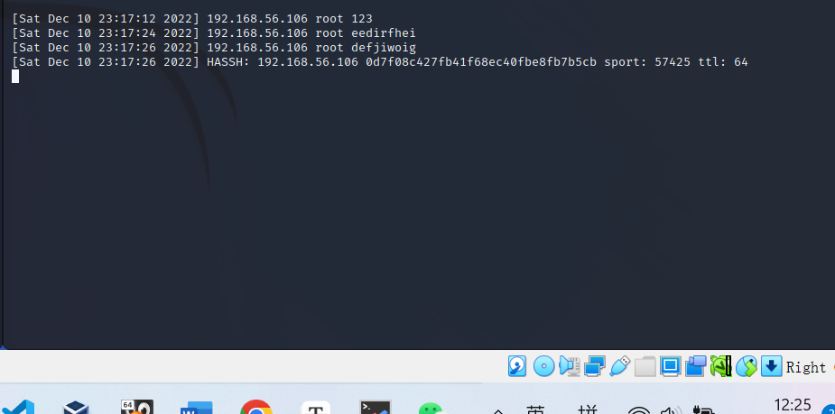

没有任何输出。在防御者主机上抓个包看看。

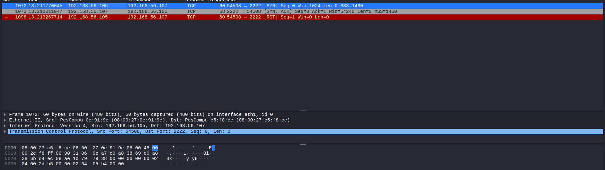

发现 2222 端口的确收到了一个 TCP 的 SYN 包，且发送了回复。但是蜜罐没有记录这个行为。说明该低交互蜜罐不关心传输层上端口扫描，只关心恶意用户是否尝试登录该端口，只有尝试 SSH 登录才会记录用户行为。

##### 如何辨别蜜罐

1. SSH 登陆时间短。在配置文件中可以看到 timeout 时间为 60 秒。一旦一分钟不进行其它操作就会自动关闭。

   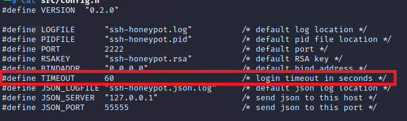

2. SSH 协议版本有差别。例如，我的虚拟机是基于 `Debian` 的 `kali` ，在进行正常 `SSH` 通信时，应该有如下通信过程：

   1. 协商版本号阶段。

   2. 协商密钥算法阶段。

   3. 认证阶段。

   4. 会话请求阶段。

   5. 交互会话阶段。

   通过抓包可以看出，首先双方进行 TCP 握手。然后交流版本号。在我虚拟机上正常的 SSH 版本号是： `SSH-2.0-OpenSSH_9.0p1 Debian-1+b1` 。

   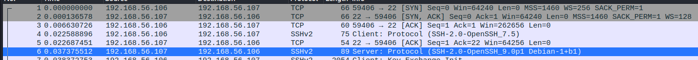

   然而，在蜜罐里的版本号是：`SSH-2.0-OpenSSH_5.9p1 Debian-5ubuntu1.4` 。 `kali` 虚拟机跟 `ubuntu` 无关，可见不是正常版本号，从此辨别出来。

   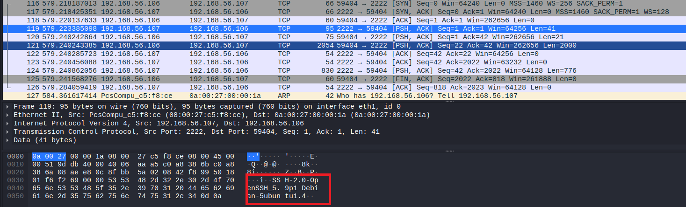


## 问题和反思

- 蜜罐选择上，或许低交互性蜜罐 `ssh-honeypot` 并不是一个好选择。一是因为它不够经典。 `kojoney` 有自己的官方网站，且影响了 `kippo` 甚至于后面的 `cowrie` 的发展，或许这个低交互蜜罐更值得探索。且搭建过程中我发现， `ssh-honeypot` 的 docker 方法还有一些问题，在头文件引用上面有一些奇怪的 `no such file or directory` 的错误，导致只能在虚拟机上 `make` 源代码再运行。或许这个蜜罐还不够 `awesome` 。
- 蜜罐辨别上，还没办法找到一个通用方法。中交互蜜罐中还可以通过猜测找到缺失的关键命令从而推断它是蜜罐，而低交互蜜罐甚至都不允许测试其它命令，找 `版本号` 未必是处处吃香的办法。


## 参考资料

- [实验 · 网络安全 (c4pr1c3.github.io)](https://c4pr1c3.github.io/cuc-ns/chap0x11/exp.html)

- [JSON file logging driver](https://docs.docker.com/config/containers/logging/json-file/)
- [GitHub - paralax/awesome-honeypots: an awesome list of honeypot resources](https://github.com/paralax/awesome-honeypots) 以及它所列的众多 honeypot

- [浅析开源蜜罐识别和全网测绘](https://zhuanlan.zhihu.com/p/342849212)
- [ssh-honeypot](https://github.com/droberson/ssh-honeypot)
- [cowrie](https://github.com/cowrie/cowrie)
- [kojoney](https://kojoney.sourceforge.net/#information)
- [Added Security for Your SSH - Endlessh: an SSH tarpit](https://www.youtube.com/watch?v=ITRlqkYxWtw)

