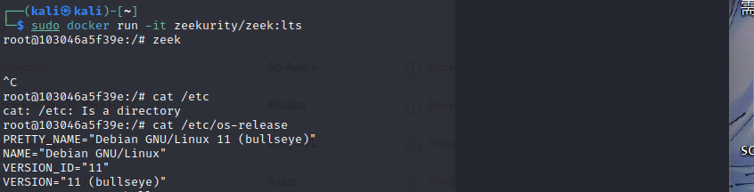
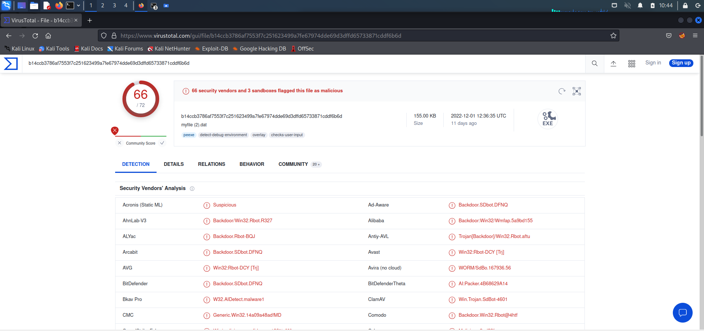

# 第十二章：计算机取证


## 实验环境


- 宿主机：win11

- 虚拟机：Linux kali 5.18.0-kali5-amd64
- docker Version:           20.10.19+dfsg1


## 实验步骤

完成自动化计算机取证，先安装工具，再让工具对证据进行分析，最后分析输出结果。


### 安装 zeek

`zeek`  是一款开源的网络安全监视工具。

> Zeek is not an active security device, like a firewall or intrusion prevention system. Rather, Zeek sits on a “sensor,” a hardware, software, virtual, or cloud platform that quietly and unobtrusively observes network traffic. Zeek interprets what it sees and creates compact, high-fidelity transaction logs, file content, and fully customized output, suitable for manual review on disk or in a more analyst-friendly tool like a security and information event management (SIEM) system.

浏览 `zeek` 的官方下载手册，发现有 `docker` 版可以使用，于是掉头使用 `docker` 版 `zeek` 。

```bash
docker pull zeekurity/zeek:lts
docker run -it zeekurity/zeek:lts
```



### 实验环境基本信息

```
PRETTY_NAME="Kali GNU/Linux Rolling"
NAME="Kali GNU/Linux"
ID=kali
VERSION="2022.3"
VERSION_ID="2022.3"
VERSION_CODENAME="kali-rolling"
ID_LIKE=debian
ANSI_COLOR="1;31"
HOME_URL="https://www.kali.org/"
SUPPORT_URL="https://forums.kali.org/"
BUG_REPORT_URL="https://bugs.kali.org/"                                       
```


### 编辑 zeek 配置文件

- 编辑 `/usr/local/zeek/share/zeek/site/local.zeek` ，在文件尾部追加两行新配置代码

```bash
@load frameworks/files/extract-all-files
@load mytuning.zeek
```

- 在 `/usr/local/zeek/share/zeek/site` 目录下创建新文件 `mytuning.zeek` ，[内容为](https://www.bro.org/documentation/faq.html#why-isn-t-bro-producing-the-logs-i-expect-a-note-about-checksums)：

```bash
redef ignore_checksums = T;
```

若没有此配置，目录下则会：

```
root@2edf7c5f7344:/workspace# ls
attack-trace.pcap  conn.log  ftp.log             ntlm.log           stats.log
capture_loss.log   dpd.log   loaded_scripts.log  packet_filter.log  weird.log
```

有此配置，目录下则会：

```
root@2edf7c5f7344:/workspace# ls
attack-trace.pcap  conn.log  extract_files  ftp.log             ntlm.log           pe.log
capture_loss.log   dpd.log   files.log      loaded_scripts.log  packet_filter.log  stats.log

```

有此配置，目录下少了 `weird.log` ，多了 `extract_files` 、`files.log` 、`pe.log` 。

其中，`weird.log` 指协议层面上，任何分析器不能理解的事情的记录。 `files.log` 记录 `zeek` 在通讯流中发现的文件。zeek 可以提取文件，但在 `files.log` 有记录并不意味着 zeek 一定提取了文件。如果想要提取文件，则必须要进行配置，就如第一条配置所示。而 `pe.log` 是 `files.log` 的再进一步，记录 `pe` 文件。


### 使用 zeek 自动化分析 pcap 文件

向容器内传入 `attack-trace.pcap` 。

```bash
$ sudo docker ps
#CONTAINER ID  
#2edf7c5f7344  
$ sudo docker cp ~/attack-trace.pcap 2edf7c5f7344:/workspace
```

用 `zeek` 分析。

```bash
zeek -r attack-trace.pcap /usr/local/zeek/share/zeek/site/local.zeek
```

在 `extract_files` 底下有一个文件：`extract-1240198114.648099-FTP_DATA-FutkFK231QTWleGBs9` 。把此文件上传到  [virustotal](https://virustotal.com/) 发现是一个后门程序。



文件名中的 `FutkFK231QTWleGBs9` 是它的唯一标识符。在 `conn.log` 中，根据在 files.log 中找到的 `conn_uid` ，能在 `conn.log` 里找到来源 IP 。在 `files.log` 里也能找到。以下 `conn_uids` 就是会话标识。

```
root@2edf7c5f7344:/workspace# zeek-cut ts tx_hosts fuid conn_uids < files.log
1240198114.648099       98.114.205.102  FutkFK231QTWleGBs9      CBIieX2XlENKJJma3j      
```

这是在 `conn.log` 中发现的：

```
root@2edf7c5f7344:/workspace# zeek-cut ts uid id.orig_h < conn.log
1240198108.374595       CBDYm21O8sQM6Cap5g      98.114.205.102
1240198110.466428       CNm4d739cSGjP8xIza      98.114.205.102
1240198108.509145       C77i544bbj00Ye5fSi      98.114.205.102
1240198114.516921       CBIieX2XlENKJJma3j      98.114.205.102
1240198113.457215       ClAImOkZPoBXQBXa7       192.150.11.111
```

可见后门程序来自 `98.114.205.102` 。


## 参考文献

- [实验 · 网络安全 (c4pr1c3.github.io)](https://c4pr1c3.github.io/cuc-ns/chap0x12/exp.html)
- [Zeek Documentation — Book of Zeek (v5.0.3)](https://docs.zeek.org/en/lts/)

- [Installing Zeek — Book of Zeek (v5.1.0)](https://docs.zeek.org/en/current/install.html)
